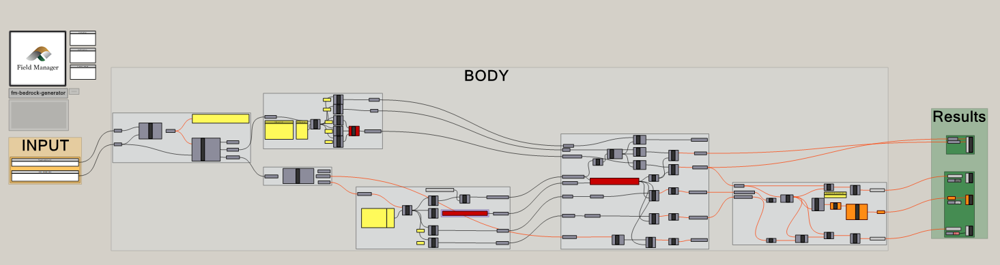

# fm-gh-bedrock-generator
This is a Grasshopper API connector to Field Manager for creation of bedrock surface mesh.
Please be warned that this is an initial release, and the script may contain errors. 

### Release note v.0.1.0
Initial release

# 1 Description
The script fetch all locations with Total Sounding (TOT) method from a project, creates 3D borehole columns and interpolates a bedrock mesh.

Conditions on data:
1. Total soundings must have status code: Conducted or Approved
2. Total soundings must have stop code 93 or 94

# 2 Dependencies
This script requires the followin plugins to be installed:
1. Swiftlet (https://www.food4rhino.com/en/app/swiftlet)
2. Lunchbox (https://www.food4rhino.com/en/app/lunchbox)

Plugins can be downloaded from www.food4rhino.com

# 3 Installation
Download the .gh file and place in your Grasshopper Components folder. 
You can open this folder from Grasshopper, go to File->Special Folders->Components Folders. 
When you have copied the file to the folder, right click on the file and select Properties. 
Make sure you have Administrator Rights and if needed check the box "Enable".  

# 4 Licence
Licensed under the MIT license.

# 5 Contribute
Have you identified a problem with the code? Have a feature request? We want to hear about it! Submit an issue or start a discussion!
