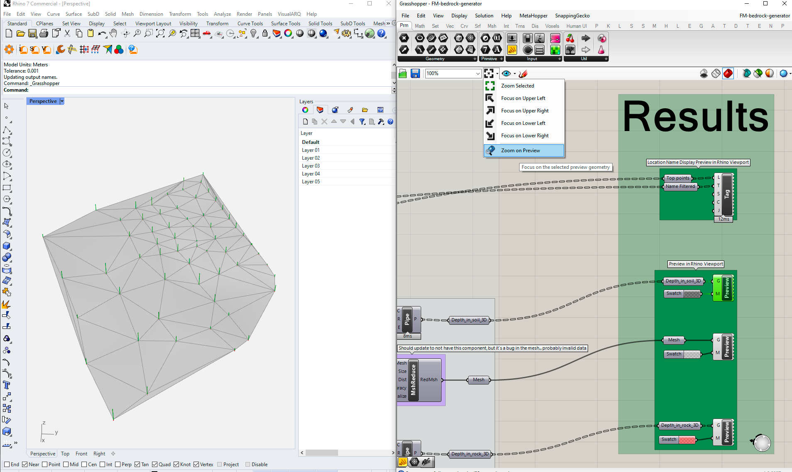

# fm-gh-bedrock-generator

This script connects [Grasshopper](https://www.rhino3d.com/) to the geotechnical site investigation data platform [Field Manager](https://fieldmanager.io) API to create the following geometries using [Norwegian Total Sounding](https://ngf.no/publikasjoner/melding-nr-9-veiledning-for-utforelse-av-totalsondering-1994/) (TOT) data:
1) Bedrock elevation mesh interpolated with [Delunay triangulation](https://en.wikipedia.org/wiki/Delaunay_triangulation)
2) 3D borehole columns with colour separation on depth_in_soil and depth_in_rock segments
3) Location ID text-tag placed at the terrain point level

Filters are applied to allow only the following data:
1. Total soundings must have status code: *Conducted* or *Approved*
2. Total soundings must have stop code *93* or *94*

**The script is a work in progress and does likely contain bugs and errors that have not been documented**

### Release note v.0.1.0
Initial release.

# Requirements
Access to the FIeld Manager API is required. Reach out to contact@fieldmanager.io to learn more. 

This script also requires the following GH plugins to be installed:
1. Swiftlet | https://www.food4rhino.com/en/app/swiftlet
2. Lunchbox | https://www.food4rhino.com/en/app/lunchbox

# Installation
Clone the repo or download the fm-gh-bedrock-generator.gh file and place in your Grasshopper Components folder. 

You can access the Components folder from Grasshopper from File-> Special Folders -> Components Folders. 
When you have copied the file to the folder, right click on the file and select Properties. 
Make sure you have Administrator Rights and if needed check the box "Enable".  

# Run the script
After you have opened the *.gh file in Grasshopper, the following input is needed:

1) enter the project number 

2) paste API token from from the Field Manager API website
app.fieldmanager.io/developer

### Check results in Rhino viewport
To see the model in the Rhino viewport, you must click on one of the preview nodes in Grasshopper, and select "zoom on preview" from the menu bar above the canvas, see figure example below: 

# Licence
Licensed under the MIT license.

# Contribute
Have you identified a problem with the code? Have a feature request? We want to hear about it! Submit an issue or start a discussion!
